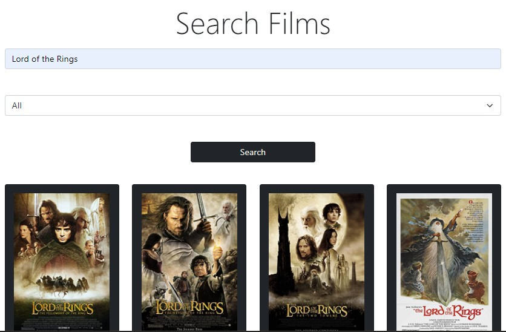

# Catalogue of Films App

A movie catalogue app where you can search for all your favourite movies.

This app is a catalogue of films where the user can search for their favorite films and apply filters on their search. Every film has a details page that the user can access by clicking on the Find Details button and see the details of the film they are interested in.

## Built With

- React
- Redux

## [Project Live Link](https://sams-catalgoue.herokuapp.com/)

## Getting Started

To get a local copy up and running follow these simple example steps.

- `git clone git@github.com:SamArsanios/catalogue.git`
- `cd catalogue`
- `npm install`
- `npm start`

To test the logic files

- `npm test`

## Author

👤 **Samson Kibrom**

- GitHub: [@SamArsanios](https://github.com/SamArsanios)
- Twitter: [@SamArsanios](https://twitter.com/SamArsanios)
- LinkedIn: [Samson Kibrom](https://www.linkedin.com/in/samson-kibrom/)

## 🤝 Contributing

Contributions, issues, and feature requests are welcome!

## Show your support

Give a ⭐️ if you like this project!

## Acknowledgments

- To Microverse for their `README` template.
- [To OMDB](https://omdbapi.com/) for the API.
- [To Beehance](https://www.behance.net/gallery/31579789/Ballhead-App-(Free-PSDs)) for design guide.
- Design idea by [Nelson Sakwa on Behance](https://www.behance.net/sakwadesignstudio)

## 📝 [License]

MIT License
